# HW-Express-Week9

Nama : Rizki Rifani (FSWD 5A)

Program ini merupakan projek Restfull API yang terdiri dari GET, POST, DELETE, dan PUT. kemudian terdapat endpoint untuk register user dan login user yang mengimplementasikan authorization dan authentication. Yang mana nantinya hanya pengguna yang terdaftar dan memiliki token yang dapat melakukan sistem CRUD pada API data movie. Pada program ini ada beberapa endpoint utama yang digunakan untuk menjalan program yaitu sebagai berikut:

- Untuk akses ke User: `http://localhost:3000/api/users` 
- Untuk akses ke  Movie: `http://localhost:3000/api/movies`
- Untuk akses melalui Swagger : `http://localhost:3000/api-docs`

Namun untuk mengakses program diperlukan endpoint yang lebih detail yaitu sebagai berikut :

- Untuk akses ke User Login: `http://localhost:3000/api/users/login`
- Untuk akses ke User Register: `http://localhost:3000/api/users/register`

Pada program ini untuk mengakses movie diperlukan cara khusus yaitu user harus sudah terdaftar dan memiliki token yang nantinya dapat digunakan untuk melakukan CRUD data movie yaitu sebagai berikut untuk endpoint lebih detail dari movie:

- Untuk mendapatkan data movie dengan pagination(GET): `http://localhost:3000/api/movies`
- Untuk membuat data movie baru(POST): `http://localhost:3000/api/`
- Untuk mendapatkan data movie by id (GET): `http://localhost:3000/api/:id`
- Untuk update data movie(PUT): `http://localhost:3000/api/:id`
- Untuk hapus data movie(DELETE): `http://localhost:3000/api/:id`


</br>
Pada program ini terdiri dari 6 folder dan 1 file utama, yaitu :
</br>

- models

Folder ini merupakan berisi file user dan movie yang digunakan untuk melakukan CRUD data dari database dengan query

- controller
  
Folder ini merupakan berisi file user dan movie yang digunakan untuk melakukan aksi ketika ada data yang akan di CRUD

- db

Folder ini berisi file yang digunakan untuk menghubungkan program ke databse postgreSQL

- middleware

Folder ini berisi file yang digunakan untuk melakukan auth

- routes

Folder ini berisi file route dari user dan movie yang digunakan untuk melakukan pemanggilan dari setiap endpoint 

- utils

Folder ini berisi konfigurasi untuk swagger

- index.js

file ini merupakan file utama untuk menjalankan keseluruhan program


## Persyaratan

Sebelum dapat menjalankan aplikasi, pastikan telah memenuhi persyaratan berikut:

- Node.js
- PostgreSQL
- Browser
- Postman

## Instalasi

1. Clone repositori ini ke komputer:

   ```bash
   git clone https://github.com/rizkirifandi7/HW-Express-Week9.git

2. Pindah ke direktori projek

   ```bash
   cd HW-Express-Week9

3. Install package module

   ```bash
   npm install
   
4. Buatlah file baru dengan nama `.env` kemudian atur dan sesuaikan dengan program 

5. Import sample data `movies-database.sql` ke database PostgreSQL

6. Proses selesai


## Demo Program
1. Pastikan semua program sudah benar dan terhubung ke database, kemudian jalankan program dengan terminal menggunakan command berikut : 

   ```bash
   npm run start

2. Untuk memudahkan cara penggunaan program, gunakanlah endpoint yang menggunakan Swagger dan masukan endpoint tersebut ke browser :

     ```bash
   http://localhost:3000/api-docs/

  Maka akan muncul seperti berikut:

  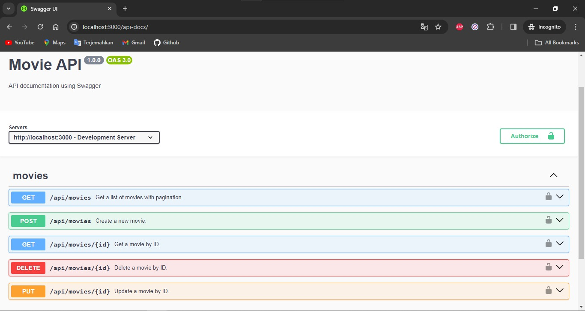
     
3. Untuk pertama cobalah untuk melakukan registrasi user dengan mengakses menu registrasi, isi setiap data nya :

  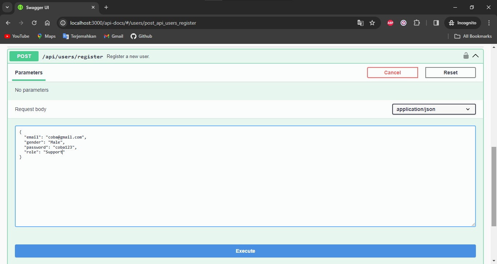

  </br>
  Maka akan menghasilkan output dan menghasilkan token yang nantinya dapat digunakan untuk melakukan CRUD data movie:

  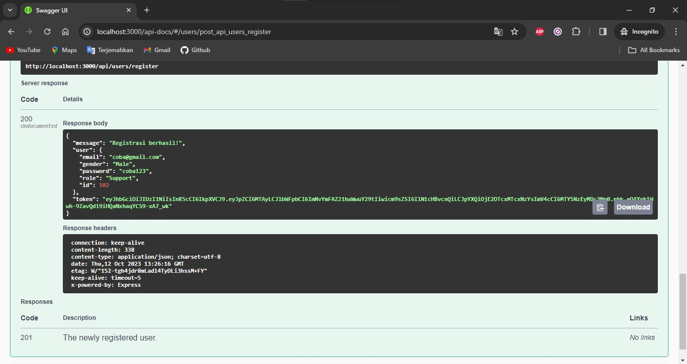

4. Kemudian cobalah melakukan login 

  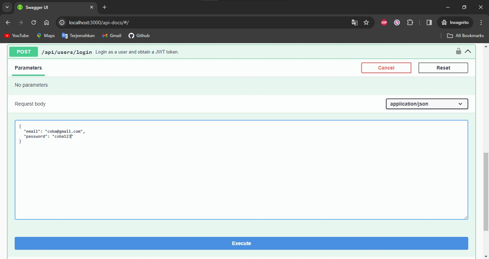
 
  </br>
   Maka akan menghasilkan output dan menghasilkan token yang nantinya dapat digunakan untuk melakukan CRUD data movie:

  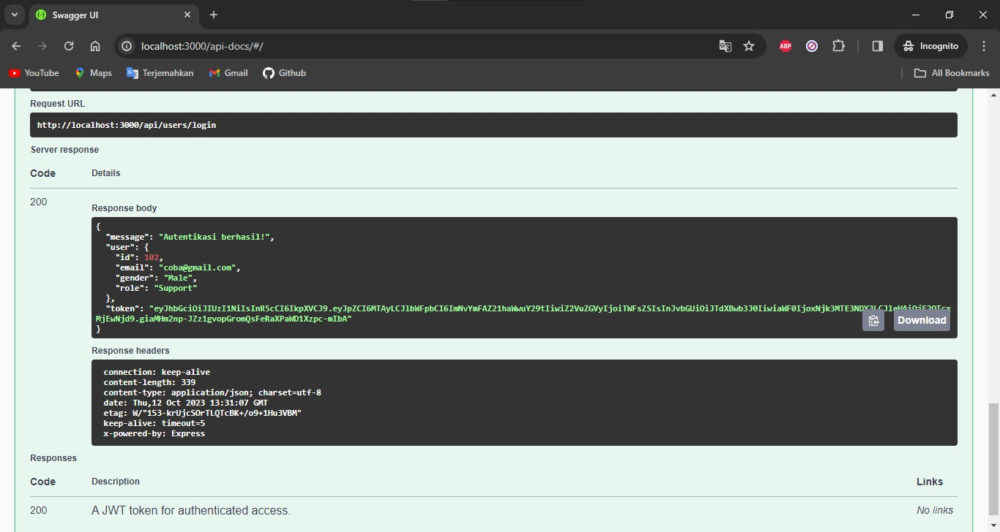

5. Kemudian cobalah melakukan CRUD database movie namun sebelum melakukan itu masukan terlebih dahulu token yang didapatkan dari hasil registrasi ataupun login, setelah itu masukan ke Authorize 

  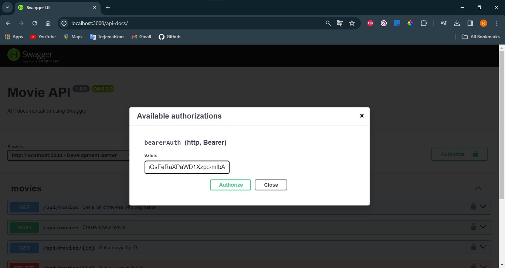
 
  </br>
   Maka akan menghasilkan output sebagai berikut dan pengguna sudah dapat melakukan CRUD untuk data movie:

  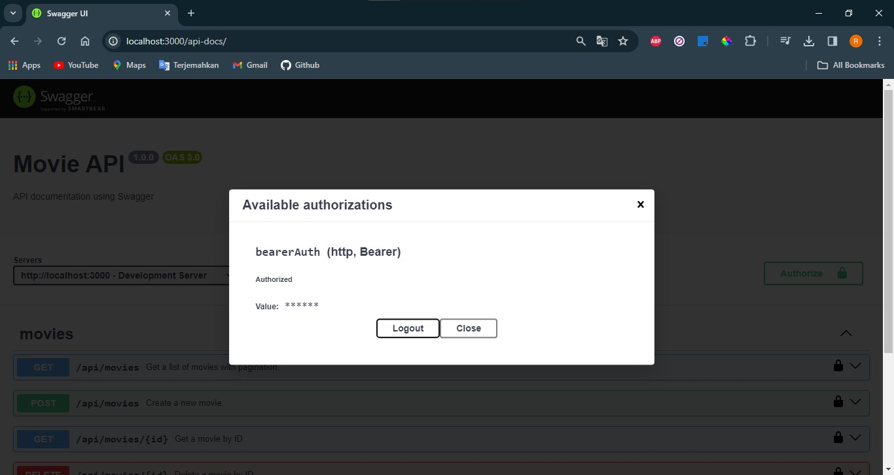

6. Kemudian cobalah melakukan CRUD database movie dengan mencoba pagination

  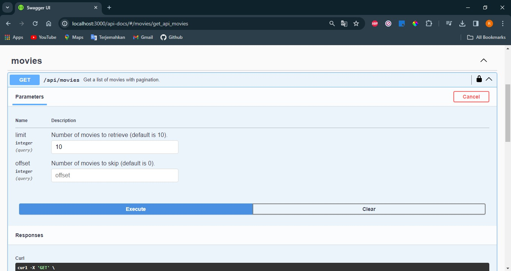
 
  </br>
   Maka akan menghasilkan output sebagai berikut:

  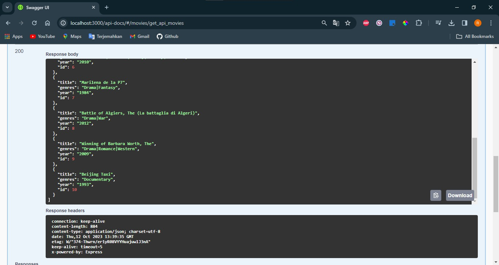

7. Kemudian cobalah melakukan CRUD database movie dengan mencoba membuat data movie baru

  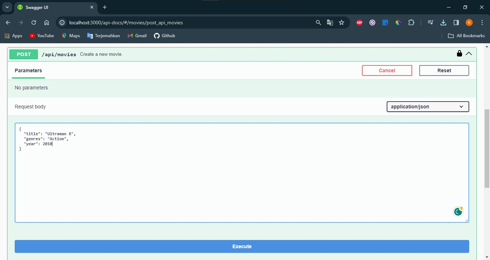
 
  </br>
   Maka akan menghasilkan output sebagai berikut:

  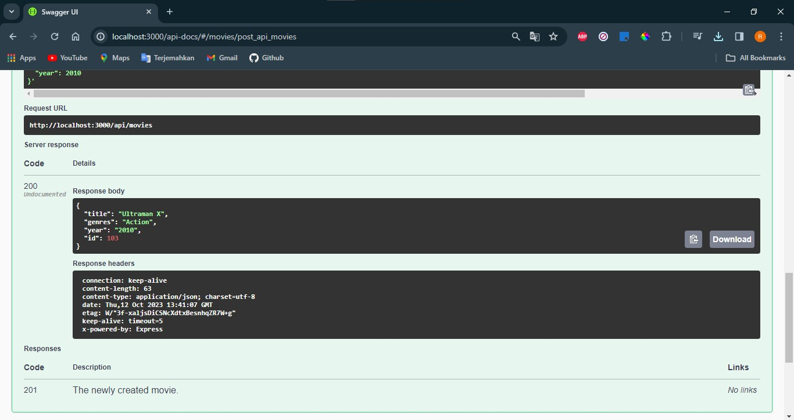

8. Kemudian cobalah melakukan CRUD database movie dengan mencoba mendapatkan data berdasarkan id

  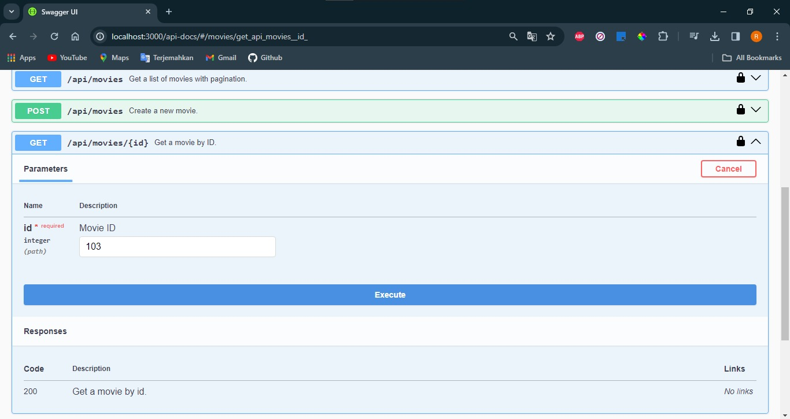
 
  </br>
   Maka akan menghasilkan output sebagai berikut:

  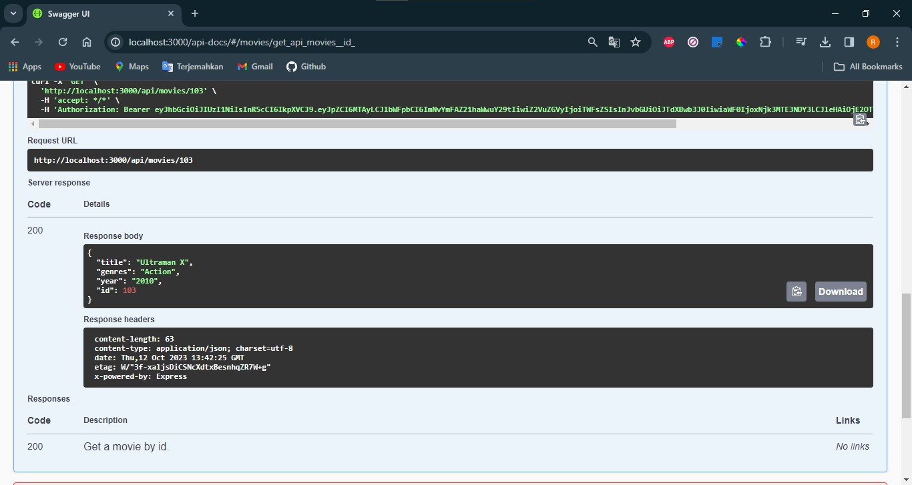

9. Kemudian cobalah melakukan CRUD database movie dengan melakukan update data

  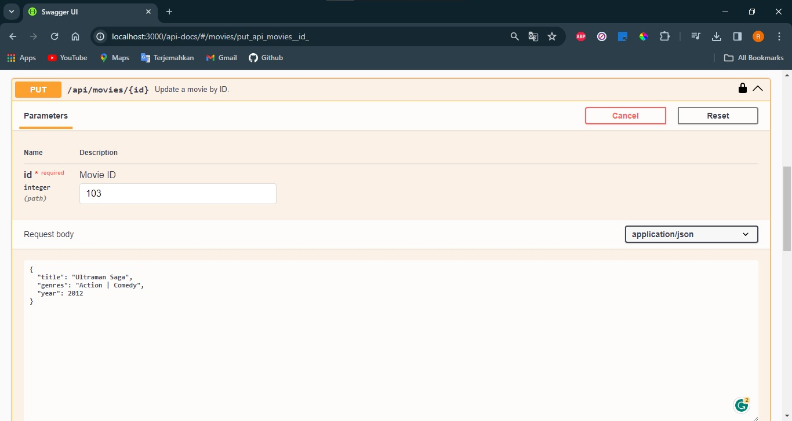
 
  </br>
   Maka akan menghasilkan output sebagai berikut:

  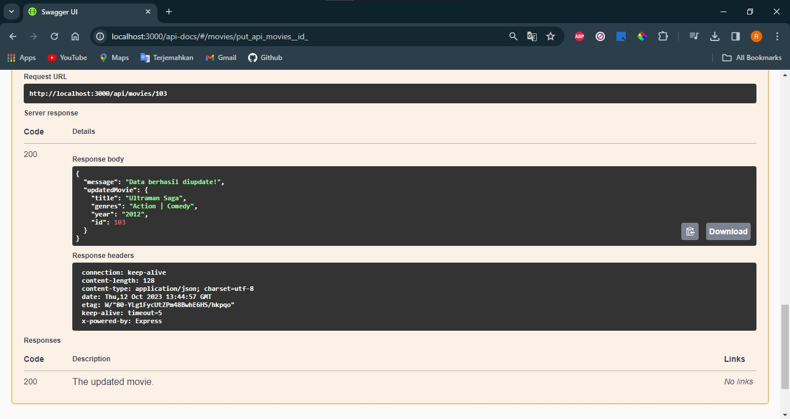

10. Kemudian cobalah melakukan CRUD database movie dengan melakukan hapus data

  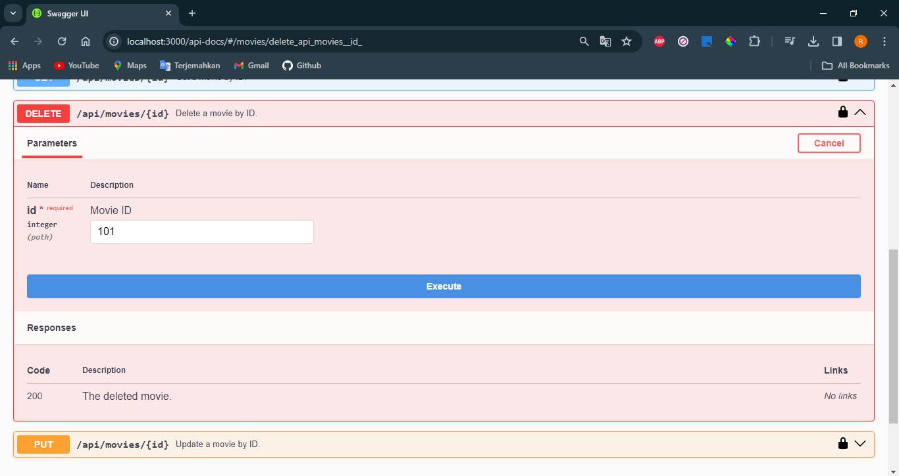
 
  </br>
   Maka akan menghasilkan output sebagai berikut:

  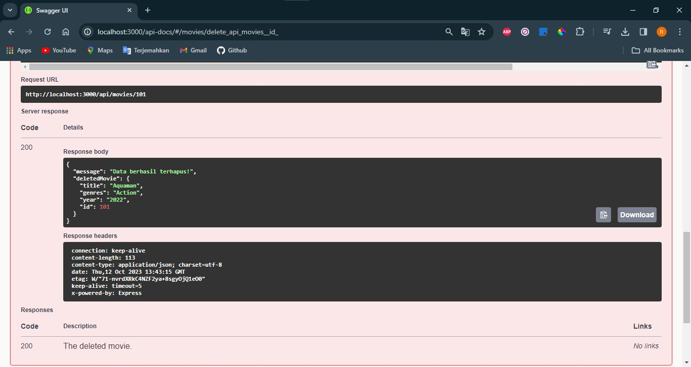
